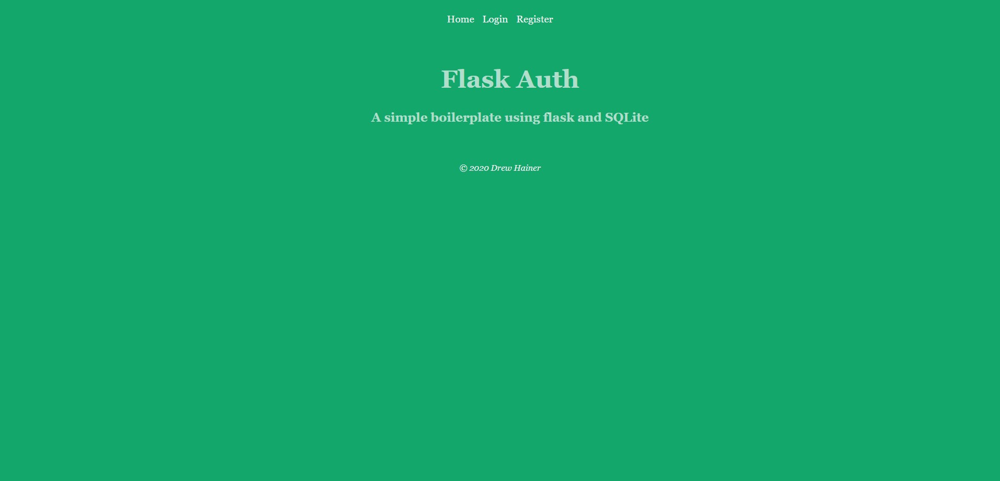

# flask-auth

## Preparing Virtual Environment

    Virtual environments allow one to easily manage Python packages.

    To create virtual environments use the following command: 
    pip install virtualenv

    Then while in the flask-auth working directory use the following command: 
    virtualenv [Environment Name]

    The environment name can be whatever you want it to be.

## Activating/Deactivating Virtual Environment

    Activating/Deactivating your virtual environment varies depending on OS.

    Windows Activation/Deactivation:
    [Environment Name]\Scripts\activate
    [Environment Name]\Scripts\deactivate

    Linux Activation/Deactivation: 
    source [Environment Name]/bin/activate
    source [Environment Name]/bin/deactivate

## Final Project Preparation

    With the virtual environment activated run the following command:
    pip install python-dotenv connectwrap flask passlib

    After that all you need to do is use the following command:
    flask run

    This spins up your application on localhost:5000 by default.

[Notes](Notes.txt) for a list of commands used in this tutorial.

## Credits

I want to thank Miguel Grinberg for his amazing Flask tutorial.
It's much more in depth and can be found here: [Miguel's Flask Tutorial](https://blog.miguelgrinberg.com/post/the-flask-mega-tutorial-part-i-hello-world)
